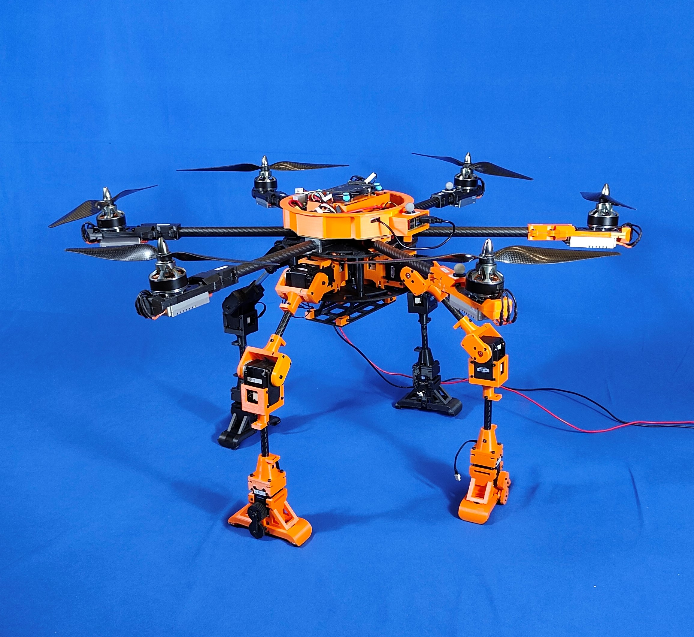
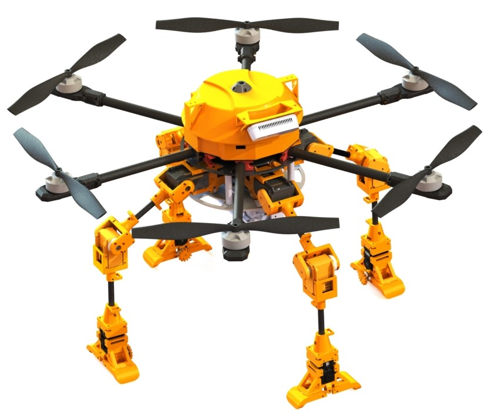
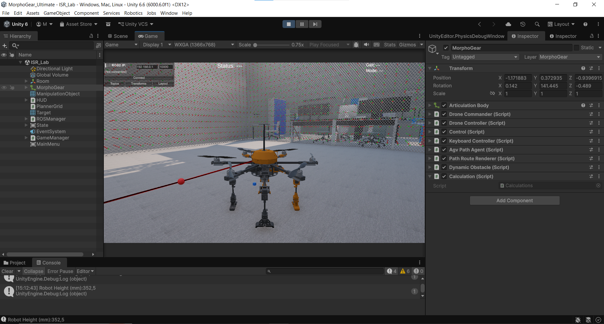
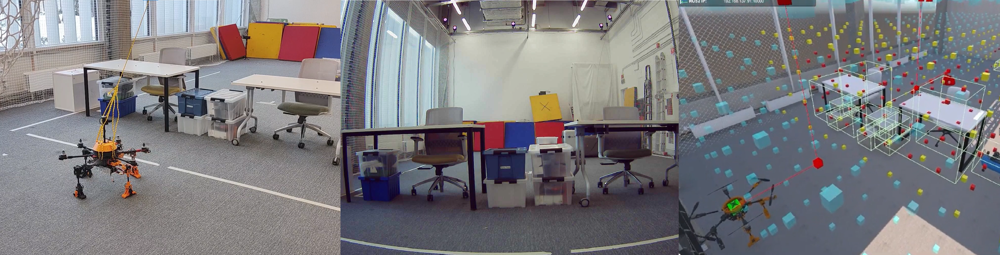

# MorphoGear

<p align="center">
  <strong>An aerial–ground robot with multi-limb morphogenetic landing gear</strong>
</p>

<p align="center">
  <a href="https://github.com/mikk686/morphogear/blob/main/LICENSE">
    
  </a>
  
  
  
</p>

<!--
IMAGE PLACEHOLDER 1 — Main repository banner or photo

Recommended path:
docs/images/morphogear_banner.jpg

After adding the image, uncomment:

<p align="center">
  
</p>
-->

<p align="center">
  
</p>

## Overview

**MorphoGear** is a multimodal aerial–ground robotic platform capable of flying, walking over uneven terrain, and interacting with objects using four articulated limbs.

The limbs act as morphogenetic landing gear during flight and as pedipulators or manipulators during ground operation. Each limb has three degrees of freedom, giving the platform 12 actuated limb degrees of freedom in total.

This repository contains:

- A **Unity-based digital twin and simulation environment**
- A **ROS 2 control interface**
- Locomotion and gait-control components
- Flight, manipulation, and path-planning components
- Communication between Unity and ROS 2
- Experimental and legacy ROS 2 implementations

> [!NOTE]
> MorphoGear is research software under active development. Interfaces, controls, and configuration files may change.

<!--
IMAGE PLACEHOLDER 2 — Flight, walking, and manipulation overview

Recommended path:
docs/images/morphogear_modes.jpg

After adding the image, uncomment:

<p align="center">
  
</p>
-->

<p align="center">
  
</p>

## Capabilities

MorphoGear is designed to investigate multimodal robotic operation, including:

- **Aerial locomotion**
- **Ground locomotion**
- **Rough-terrain traversal**
- **Multiple walking gaits**
- **Morphology adaptation**
- **Object grasping and manipulation**
- **Digital-twin simulation**
- **ROS 2 integration**
- **Trajectory-based limb control**

The original MorphoGear platform demonstrated walking with several gait patterns and a step length of up to 210 mm. Further technical details and experimental results are available in the accompanying paper.

## Repository Structure

```text
morphogear/
├── ROS2/
│   ├── Current/
│   │   └── my_csharp_node/    # Current ROS 2 control node in C#
│   └── Original/
│       └── ros2_dotnet_ws/    # Original ROS 2/.NET workspace
├── Unity/
│   └── morphogear/            # Unity simulation project
│       ├── Assets/
│       │   ├── Laboratory/    # Simulation environment
│       │   ├── Materials/
│       │   ├── Models/
│       │   ├── Prefabs/
│       │   ├── Resources/
│       │   ├── Scenes/
│       │   └── Scripts/
│       │       ├── Flight/
│       │       ├── Locomotion/
│       │       ├── Manipulation/
│       │       ├── PathPlan/
│       │       └── ROS/
│       ├── Packages/
│       └── ProjectSettings/
├── LICENSE
└── README.md
```

## Software Requirements

### Unity simulation

- [Unity Hub](https://unity.com/download)
- A Unity Editor version compatible with the version recorded in:
  `Unity/morphogear/ProjectSettings/ProjectVersion.txt`
- Git, including Git support in the Unity Package Manager
- A platform supported by the selected Unity version

The Unity project uses packages including:

- Universal Render Pipeline
- Unity Input System
- AI Navigation
- ROS–TCP Connector
- ROS visualization tools
- Visual Scripting

### ROS 2 controller

- Linux with [ROS 2](https://docs.ros.org/)
- `colcon`
- `ament_cmake`
- [.NET 8 SDK](https://dotnet.microsoft.com/download/dotnet/8.0)
- Rcl.NET and the ROS 2 message packages required by the project

The current build configuration publishes a `linux-arm64` executable. If you are building on another architecture, update the runtime identifier in:

```text
ROS2/Current/my_csharp_node/CMakeLists.txt
```

For example, use `linux-x64` for a conventional 64-bit x86 Linux system.

## Installation

### 1. Clone the repository

```bash
git clone https://github.com/mikk686/morphogear.git
cd morphogear
```

### 2. Open the Unity project

1. Start Unity Hub.
2. Select **Add project from disk**.
3. Choose:

   ```text
   morphogear/Unity/morphogear
   ```

4. Allow Unity to import the project and restore its packages.
5. Open the main simulation scene:

   ```text
   Assets/Scenes/ISR_Lab.unity
   ```

6. Enter Play mode to start the simulation.

On the first import, Unity may need additional time to download the ROS–TCP Connector and other Git-based packages.

<!--
IMAGE PLACEHOLDER 3 — Screenshot of the Unity simulation

Recommended path:
docs/images/unity_simulation.jpg

After adding the image, uncomment:

<p align="center">
  
</p>
-->

<p align="center">
  
</p>

### 3. Build the current ROS 2 node

Source your ROS 2 installation:

```bash
source /opt/ros/$ROS_DISTRO/setup.bash
```

Build the ROS 2 package:

```bash
cd morphogear/ROS2/Current
colcon build
```

Source the resulting workspace:

```bash
source install/setup.bash
```

Run the controller:

```bash
ros2 run my_csharp_node my_csharp_node
```

Alternatively, the .NET project can be inspected or built directly:

```bash
cd morphogear/ROS2/Current/my_csharp_node
dotnet restore
dotnet build
```

## Unity–ROS 2 Connection

The Unity project uses the Unity Robotics ROS–TCP Connector. Before starting a connected simulation:

1. Start the required ROS 2 communication endpoint.
2. Configure the ROS IP address and port in Unity.
3. Make sure the Unity and ROS machines can reach each other.
4. Check that both sides use matching topic names and message types.
5. Start the ROS 2 controller and then enter Play mode in Unity.

If Unity and ROS 2 run on different computers, ensure that the relevant firewall rules permit the connection.

## ROS 2 Interface

The current C# controller uses the following ROS 2 topics.

### Subscribed topics

| Topic | Message type | Description |
|---|---|---|
| `/keyboard_state` | `std_msgs/msg/String` | Per-frame input state received from Unity |
| `morphogear_sudo_cmd` | `std_msgs/msg/String` | Legacy command interface |
| `/theta_angles` | `std_msgs/msg/Int8MultiArray` | Joint trajectories, including externally generated trajectories |
| `morphogear_sudo_manual` | `std_msgs/msg/Bool` | Switch between manual and internal control |

### Published topics

| Topic | Message type | Description |
|---|---|---|
| `/angles_control` | `std_msgs/msg/Int8MultiArray` | Limb-angle commands, published at approximately 20 Hz |
| `/request_angles` | `std_msgs/msg/Empty` | Request for the current joint angles |
| `/robot_state` | `std_msgs/msg/String` | Robot-state information, published at approximately 10 Hz |

You can inspect the running interface with:

```bash
ros2 node list
ros2 topic list
ros2 topic info /angles_control
ros2 topic echo /robot_state
```

## Using the Simulation

A typical workflow is:

1. Launch the ROS 2 communication endpoint.
2. Start `my_csharp_node`.
3. Open `Assets/Scenes/ISR_Lab.unity`.
4. Configure the ROS connection in Unity.
5. Enter Play mode.
6. Select the required locomotion or control mode.
7. Send input through the Unity interface or ROS 2 topics.
8. Monitor `/robot_state` and `/angles_control`.

The controller contains multiple gait implementations and supports transitions between robot configurations. Verify that the robot is in a safe initial pose before sending movement commands.

<!--
IMAGE PLACEHOLDER 4 — Walking gait sequence or ROS/Unity diagram

Recommended path:
docs/images/gait_sequence.jpg

After adding the image, uncomment:

<p align="center">
  
</p>
-->

<p align="center">
  
</p>

## Development Notes

- `ROS2/Current/` contains the current controller implementation.
- `ROS2/Original/` is retained for reference and reproducibility.
- Generated build artifacts should not normally be committed.
- Keep ROS topic definitions synchronized between Unity and ROS 2.
- Open the project using the Unity version recorded in `ProjectVersion.txt`.
- Rebuild the ROS 2 workspace after changing the C# node or build configuration.

To clean and rebuild the current ROS 2 workspace:

```bash
cd morphogear/ROS2/Current
rm -rf build install log
source /opt/ros/$ROS_DISTRO/setup.bash
colcon build
source install/setup.bash
```

## Troubleshooting

### Unity cannot restore ROS packages

Confirm that:

- Git is installed and available from the command line.
- Unity has network access.
- The GitHub package URLs in `Packages/manifest.json` are accessible.

### ROS 2 cannot find `my_csharp_node`

Source both ROS 2 and the local workspace:

```bash
source /opt/ros/$ROS_DISTRO/setup.bash
source morphogear/ROS2/Current/install/setup.bash
```

Then check:

```bash
ros2 pkg list | grep my_csharp_node
```

### The .NET build targets the wrong architecture

The current CMake configuration uses:

```text
linux-arm64
```

Change the runtime identifier in `CMakeLists.txt` to match the target computer, then perform a clean rebuild.

### Unity does not communicate with ROS 2

Check:

- The ROS endpoint is running.
- The configured IP address and port are correct.
- The machines are on the same reachable network.
- Topic names and message types match.
- No firewall is blocking the connection.

## Citation

If you use MorphoGear in academic work, please cite:

> M. Martynov, Z. Darush, A. Fedoseev, and D. Tsetserukou,  
> “MorphoGear: An UAV with Multi-Limb Morphogenetic Gear for Rough-Terrain Locomotion,”  
> in *2023 IEEE/ASME International Conference on Advanced Intelligent Mechatronics (AIM)*, 2023, pp. 11–16.  
> [10.1109/AIM46323.2023.10196115](doi.org/10.1109/AIM46323.2023.10196115)

### BibTeX

```bibtex
@inproceedings{martynov2023morphogear,
  author    = {Mikhail Martynov and Zhanibek Darush and
               Aleksey Fedoseev and Dzmitry Tsetserukou},
  title     = {{MorphoGear}: An {UAV} with Multi-Limb Morphogenetic
               Gear for Rough-Terrain Locomotion},
  booktitle = {2023 IEEE/ASME International Conference on
               Advanced Intelligent Mechatronics (AIM)},
  year      = {2023},
  pages     = {11--16},
  url       = {doi.org/10.1109/AIM46323.2023.10196115}
}
```

The arXiv version may also be cited directly:

```bibtex
@article{martynov2024morphogear,
  author        = {Mikhail Martynov and Zhanibek Darush and
                   Aleksey Fedoseev and Dzmitry Tsetserukou},
  title         = {{MorphoGear}: An {UAV} with Multi-Limb Morphogenetic
                   Gear for Rough-Terrain Locomotion},
  journal       = {arXiv preprint arXiv:2403.08340},
  year          = {2024},
  eprint        = {2403.08340},
  archivePrefix = {arXiv},
  primaryClass  = {cs.RO},
  url           = {https://arxiv.org/abs/2403.08340}
}
```

## Contributing

Contributions, bug reports, and improvements are welcome.

1. Fork the repository.
2. Create a feature branch:

   ```bash
   git checkout -b feature/my-improvement
   ```

3. Commit your changes.
4. Push the branch to your fork.
5. Open a pull request describing the change and how it was tested.

For bug reports, please include:

- Operating system
- ROS 2 distribution
- Unity version
- .NET SDK version
- Console output or error messages
- Steps required to reproduce the issue

## License

This project is distributed under the [MIT License](LICENSE).

Copyright © 2026 Mikhail Martynov.
